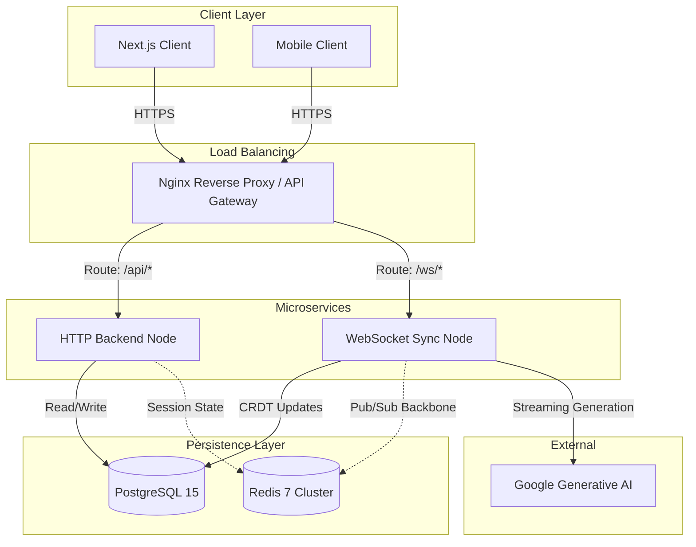
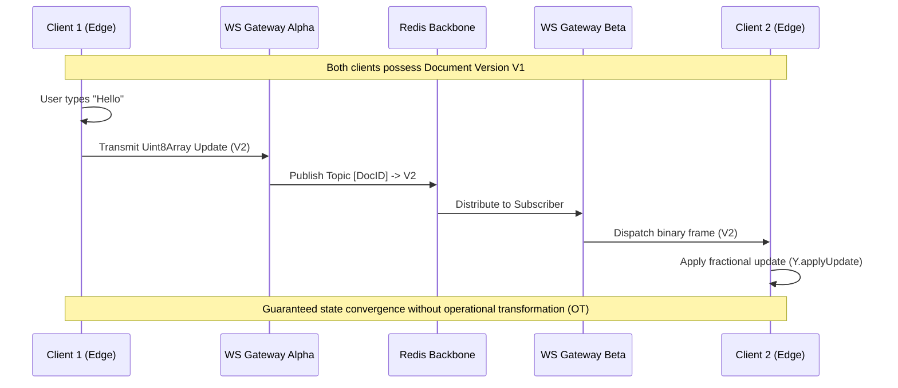
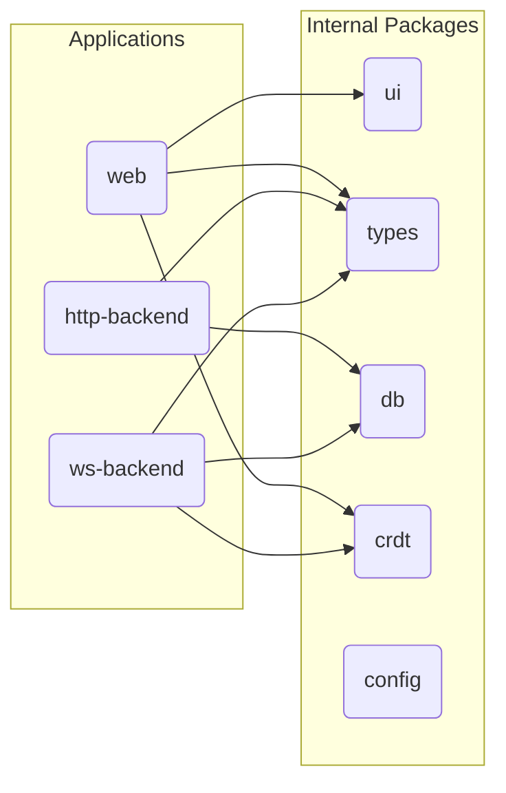
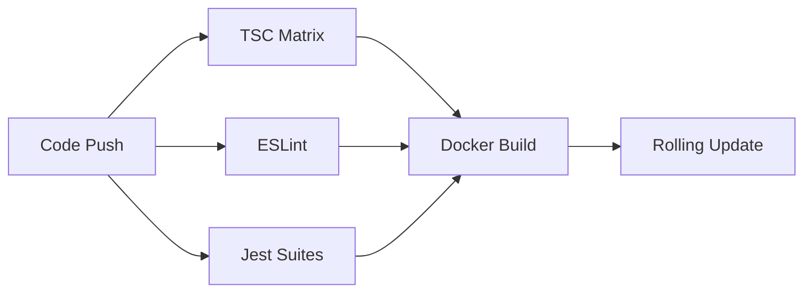

<div align="center">
  <h1>Knowdex Core Architecture</h1>
  <p><strong>High-Performance Distributed Knowledge Management Protocol</strong></p>
</div>

<br />

Knowdex is a local-first, structurally consistent collaborative knowledge graph. It relies on advanced Conflict-free Replicated Data Types (CRDTs) to guarantee high-fidelity data synchronization and deterministic conflict resolution across an arbitrarily large network of edge clients.

## Architectural Topology

The backend topology separates long-lived, stateful connections from stateless HTTP requests, ensuring that resource-intensive WebSocket broadcasts do not degrade standard API performance.



## Conflict-Free Replicated Data Protocol (CRDT)

At the core of the collaboration engine lies the `Y.js` protocol. When concurrent updates occur across isolated network partitions, the CRDT algorithm guarantees that all peers mathematically converge on the identical final document state.

### Multi-Node Synchronization Flow



## Component Architecture

Knowdex is orchestrated as a Turborepo monorepo, delineating rigid boundaries between generic utilities and domain-specific microservices.



### Module Specifications

- **`@repo/crdt`**: Defines the proprietary binary codecs utilized for data transport between clients and the WebSocket gateway, preventing parsing overhead associated with JSON payloads.
- **`@repo/db`**: Manages the unified PostgreSQL schema via Prisma. Enforces foreign key constraints and referential integrity across the system.
- **`apps/ws-backend`**: A scalable, non-blocking Node.js process dedicated exclusively to multiplexing WebSocket streams and coordinating the Y.js state vector.
- **`apps/http-backend`**: A traditional stateless REST API managing authentication boundaries, role-based access control, and metadata querying.

## System Prerequisites

To deploy or build the Knowdex ecosystem, the following host environments must be provisioned:

- Container Orchestrator: Docker Engine 24.0+
- Orchestration Tool: Docker Compose v2.20+
- Runtime: Node.js 20.x LTS
- Package Manager: pnpm 9.0+

## Local Deployment

1. **Environment Configuration**
   Provision the environment variables required for cryptographic signing and external integrations.

   ```bash
   cp .env.example .env
   ```

2. **Containerized Provisioning**
   Initialize the complete stack via Docker Compose. This strategy ensures parity with production topology.

   ```bash
   docker compose up --build -d
   ```

3. **Service Verification**
   Verify all subsystems are operational and responding to health checks.
   - Application Gateway: http://localhost:3000
   - REST Services: http://localhost:8000/health
   - WebSocket Services: http://localhost:8080/health

## Continuous Delivery Pipeline

The CI/CD pipeline enforces rigorous static analysis prior to image generation.



Production environments utilize independently deployed artifacts, allowing the WebSocket nodes to scale autonomously from the HTTP cluster in response to high concurrency scenarios.
